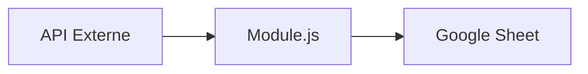

# Guide de Contribution - KPI NANCOMCY

Merci de votre intérêt pour contribuer au projet KPI NANCOMCY ! Ce guide vous aidera à apporter des modifications de qualité.

## 📋 Table des Matières

- [Prérequis](#prérequis)
- [Configuration de l'environnement](#configuration-de-lenvironnement)
- [Conventions de code](#conventions-de-code)
- [Processus de contribution](#processus-de-contribution)
- [Ajouter une nouvelle source de données](#ajouter-une-nouvelle-source-de-données)
- [Tests](#tests)
- [Documentation](#documentation)

---

## Prérequis

- **Google Apps Script** - Connaissance de base de JavaScript
- **Google Sheets** - Familiarité avec les API Google
- **Git** - Pour le versioning

## Configuration de l'environnement

### 1. Clone du projet

```bash
git clone <repository-url>
cd KPI-NANCOMCY
```

### 2. Configuration des propriétés de script

Dans Google Apps Script, configurez les propriétés suivantes:

**Obligatoires:**
- `MATOMO_TOKEN`
- `MAGNETIS_API_KEY`
- `PAPERFORM_TOKEN`
- `MONDAY_TOKEN`
- `META_TOKEN`
- `CLIENT_ID`
- `CLIENT_SECRET`
- `GOOGLE_ADS_CUSTOMER_ID`
- `GOOGLE_ADS_DEVELOPER_TOKEN`
- `META_AD_ACCOUNT_ID`

**Optionnelles:**
- `MATOMO_SEGMENT_ID`
- `GOOGLE_ADS_LOGIN_CUSTOMER_ID`

### 3. Déploiement avec CLASP (optionnel)

```bash
npm install -g @google/clasp
clasp login
clasp push
```

---

## Conventions de code

### Nommage

**Fonctions:**
- Publiques: `camelCase` (ex: `runAllTests()`)
- Privées: `camelCase_` avec underscore final (ex: `fetchData_()`)
- Préfixes par module: `SITE_`, `META_`, `Ads_`, `Utils_`

**Constantes:**
- UPPERCASE avec underscores (ex: `SHEET_NAME_ADS`)
- Configuration dans `Config.js`

**Variables:**
- camelCase (ex: `monthKey`, `byMonth`)

### Style de code

```javascript
// ✅ BON
function fetchData(startDate, endDate) {
  Validators.validateDateRange(startDate, endDate, 'fetchData');
  
  try {
    const data = apiCall();
    return processData(data);
  } catch (error) {
    ErrorHandler.logError('fetchData', error, 'ERROR', { startDate, endDate });
    throw error;
  }
}

// ❌ MAUVAIS
function fetchData(startDate,endDate){
  var data=apiCall()
  return processData(data)
}
```

### JSDoc

**Obligatoire** pour toutes les fonctions publiques:

```javascript
/**
 * Récupère les données mensuelles pour une période donnée.
 * @param {Date} startDate - Date de début (inclusive)
 * @param {Date} endDate - Date de fin (inclusive)
 * @param {object} options - Options de configuration
 * @param {boolean} options.cache - Activer le cache (défaut: true)
 * @returns {object} Données agrégées par mois au format { 'YYYY-MM': {...} }
 * @throws {Error} Si les dates sont invalides ou si l'API retourne une erreur
 */
function fetchMonthlyData(startDate, endDate, options = {}) {
  // ...
}
```

---

## Processus de contribution

### 1. Branching

```bash
# Créer une branche pour votre modification
git checkout -b feature/nouvelle-source-api
git checkout -b fix/correction-bug-matomo
git checkout -b docs/mise-a-jour-readme
```

### 2. Développement

1. **Écrire les tests d'abord** (TDD recommandé)
2. **Implémenter la fonctionnalité**
3. **Exécuter les tests**: `runAllTests()`
4. **Vérifier les logs** pour les erreurs

### 3. Validation pré-commit

**Checklist obligatoire:**
- [ ] Tests ajoutés/mis à jour
- [ ] `runAllTests()` passe sans erreur
- [ ] JSDoc complété pour les nouvelles fonctions
- [ ] `README.md` mis à jour si nécessaire
- [ ] Pas de secrets hardcodés (utiliser Script Properties)
- [ ] Code formaté et commenté

### 4. Commit

```bash
git add .
git commit -m "feat: ajout intégration API XYZ"
git commit -m "fix: correction parsing dates Matomo"
git commit -m "docs: mise à jour README avec nouvelle API"
```

**Format des messages:**
- `feat:` - Nouvelle fonctionnalité
- `fix:` - Correction de bug
- `docs:` - Documentation
- `refactor:` - Refactoring sans changement fonctionnel
- `test:` - Ajout/modification de tests
- `chore:` - Maintenance (dépendances, config, etc.)

---

## Ajouter une nouvelle source de données

### Exemple: Ajouter l'API "ExampleAPI"

#### 1. Configuration

**Dans `Config.js`**, ajouter les constantes:

```javascript
const CONFIG = {
  // ... existant
  EXAMPLE_API_URL: 'https://api.example.com/v1',
  EXAMPLE_API_TIMEOUT: 30000,
};
```

**Dans `Utils.js`**, ajouter le getter de token:

```javascript
function Utils_getExampleToken() {
  return Utils_getProperty('EXAMPLE_API_TOKEN', [], true);
}
```

#### 2. Créer le fichier du module

**Créer `Example.js`:**

```javascript
/**
 * Example.js
 * Collecte des KPIs depuis l'API Example
 */

// Configuration
const EXAMPLE_SHEET_NAME = 'Example';
const EXAMPLE_START_ROW = 6;
const EXAMPLE_HEADERS_ROW = 3;

/**
 * Récupère les données mensuelles depuis Example API
 * @param {Date} fromDate - Date de début
 * @param {Date} toDate - Date de fin
 * @returns {object} Données au format { 'YYYY-MM': {...} }
 */
function EXAMPLE_fetchMonthly_(fromDate, toDate) {
  Validators.validateDateRange(fromDate, toDate, 'EXAMPLE_fetchMonthly');
  
  const token = Utils_getExampleToken();
  const url = `${getConfig('EXAMPLE_API_URL')}/data`;
  
  // Appel API avec retry
  return ErrorHandler.executeWithRetry(
    () => {
      const response = UrlFetchApp.fetch(url, {
        method: 'get',
        headers: { 'Authorization': `Bearer ${token}` },
        muteHttpExceptions: true
      });
      
      if (response.getResponseCode() >= 300) {
        throw new Error(`Example API error: ${response.getContentText()}`);
      }
      
      return JSON.parse(response.getContentText());
    },
    'Example API fetch',
    3
  );
}

/**
 * Job principal pour synchroniser les données
 */
function run_Example_FullHistory() {
  const sheet = Validators.validateSheetExists(
    SpreadsheetApp.getActive(),
    EXAMPLE_SHEET_NAME,
    'run_Example_FullHistory'
  );
  
  // ... logique de synchronisation
}
```

#### 3. Ajouter des tests

**Dans `Tests.js`:**

```javascript
function test_EXAMPLE_parseResponse() {
  const tests = [
    {
      name: "Réponse valide",
      input: { data: [{ month: '2025-11', value: 100 }] },
      expected: { '2025-11': { value: 100 } }
    }
  ];
  
  // ... logique de test
}

// Ajouter dans runAllTests()
const results = {
  // ... existants
  'EXAMPLE_parseResponse': test_EXAMPLE_parseResponse()
};
```

#### 4. Documentation

**Mettre à jour `README.md`:**

```markdown
### Sources de Données
10. **Example API** - Description de la source
```

**Mettre à jour `Sheet_Structures.md`:**

```markdown
## Onglet : Example

* **Nom de l'onglet :** `Example`
* **Ligne d'en-têtes :**
  ```
  Mois | Métrique 1 | Métrique 2 | ...
  ```
* **Colonnes avec Formules (à ne pas écraser) :**
  * `Métrique calculée`
```

---

## Tests

### Exécuter les tests

```javascript
// Dans Google Apps Script
runAllTests()
```

### Écrire un nouveau test

```javascript
/**
 * Test de la fonction maFonction
 */
function test_maFonction() {
  const tests = [
    {
      name: "Cas nominal",
      input: { /* ... */ },
      expected: { /* ... */ }
    },
    {
      name: "Cas d'erreur",
      input: null,
      expected: {}
    }
  ];
  
  let passed = 0;
  let failed = 0;
  
  tests.forEach(test => {
    const result = maFonction(test.input);
    const resultStr = JSON.stringify(result);
    const expectedStr = JSON.stringify(test.expected);
    
    if (resultStr === expectedStr) {
      passed++;
    } else {
      failed++;
      Logger.log(`❌ FAIL [${test.name}]: result=${resultStr}, expected=${expectedStr}`);
    }
  });
  
  Logger.log(`test_maFonction: ${passed} passed, ${failed} failed`);
  return failed === 0;
}
```

### Couverture de tests

**Objectif:** 50%+ de couverture

**Priorités:**
1. Fonctions de parsing API
2. Fonctions d'agrégation
3. Fonctions de validation
4. Helpers et utilitaires

---

## Documentation

### Fichiers à maintenir

1. **README.md** - Vue d'ensemble, configuration, utilisation
2. **Sheet_Structures.md** - Structure des feuilles Google Sheets
3. **CONTRIBUTING.md** - Ce guide (vous y êtes !)
4. **JSDoc** - Dans tous les fichiers .js

### Diagrammes

Utiliser **Mermaid** pour les diagrammes:

```markdown

```

---

## Questions fréquentes

### Comment déboguer un problème ?

1. **Activer les logs détaillés:**
   ```javascript
   Logger.log('[DEBUG] Variable:', maVariable);
   ```

2. **Vérifier les logs:**
   - Apps Script: `View > Logs` (Ctrl+Enter)

3. **Utiliser ErrorHandler:**
   ```javascript
   ErrorHandler.logError('MyFunction', error, 'ERROR', { context: 'data' });
   ```

### Comment gérer les timeouts ?

**Apps Script limite: 6 minutes d'exécution**

Solutions:
- Découper en jobs plus petits (Full History → batches)
- Utiliser `Utils_executeWithRetry` pour les appels API
- Ajouter des `Utilities.sleep()` entre les appels

### Comment ajouter une nouvelle propriété de script ?

1. **Ajouter le getter dans `Config.js`:**
   ```javascript
   function getMyNewProperty() {
     const prop = PropertiesService.getScriptProperties().getProperty('MY_PROPERTY');
     if (!prop) throw new Error('MY_PROPERTY manquante');
     return prop;
   }
   ```

2. **Documenter dans README.md** (section Configuration)

---

## Contact

Pour toute question ou suggestion:
- Ouvrir une issue sur le repository
- Contacter l'équipe de développement

**Merci de contribuer à KPI NANCOMCY !** 🚀
